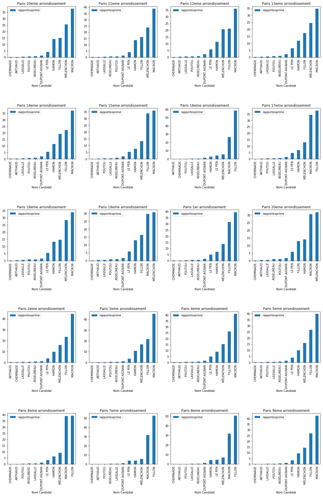
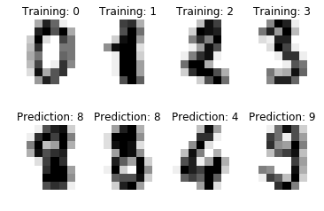

Requests : super simple requests
--------------------------------

Warning: Recreational use of other HTTP libraries may result in
dangerous side-effects, including: security vulnerabilities, verbose
code, reinventing the wheel, constantly reading documentation,
depression, headaches, or even death.

.. code:: ipython3

    import requests
    r = requests.get('https://api.github.com/users/LucasBerbesson/repos')
    data = r.json()
    
    for element in data:
        print(element['language'],":", element['clone_url'])

.. parsed-literal::

    HTML : https://github.com/LucasBerbesson/apifier.git
    Arduino : https://github.com/LucasBerbesson/Bricolage-numerique.git
    Arduino : https://github.com/LucasBerbesson/Laser-cat.git
    Jupyter Notebook : https://github.com/LucasBerbesson/mightypython.git
    Python : https://github.com/LucasBerbesson/notification-box.git
    Arduino : https://github.com/LucasBerbesson/pixelstick.git
    Batchfile : https://github.com/LucasBerbesson/python-guide.git
    Arduino : https://github.com/LucasBerbesson/teatime.git

Bottle : micro framework
------------------------

Bottle is a fast, simple and lightweight WSGI micro web-framework for
Python.

.. code:: ipython3

    from bottle import route, run, template
    
    @route('/hello/<name>')
    def index(name):
        return template('<b>Hello {{name}}</b>!', name=name)
    
    #run(host='localhost', port=8080)

Faker : generate fake data
--------------------------

Faker is a Python package that generates fake data for
you.\ `Documentation <https://faker.readthedocs.io/en/latest/>`__

.. code:: ipython3

    from faker import Faker
    f = Faker(locale="fr_FR")
    name = f.name()
    postcode = f.postcode()
    email = f.email()
    city = f.city()
    color = f.hex_color()
    print(name,postcode,email,city,color)

.. parsed-literal::

    Nicolas Ruiz 55933 ferrandjean@voila.fr Barbier #ca5dfe

Jinja2 : template engine
------------------------

Jinja2 is a full featured template engine for
Python.\ `Documentation <http://jinja.pocoo.org/docs/>`__

.. code:: ipython3

    from jinja2 import Environment, FileSystemLoader
    
    env = Environment(loader=FileSystemLoader('templates'))
    template = env.get_template('jinja_demo.html')
    links = [
        {"href":"http://google.com", "caption":"google"},
        {"href":"http://github.com", "caption":"github"},
        {"href":"http://stackoverflow.com/", "caption":"Stack Overflow"},
        {"href":"https://www.reddit.com/r/Python/", "caption":"Subreddit Python"},
        {"href":"https://www.lafabriquediy.com/", "caption":"La Fabrique DIY"},
        {"href":"https://www.lemonde.fr/", "caption":"Le monde"}
    ]
    result = template.render(title='Mes sites préférés', links=links)
    
    
    # to save the results
    with open("./templates/result.html", "w+") as fh:
        fh.write(result)

Jupyter: interactive python notebook
------------------------------------

| The Jupyter Notebook is an open-source web application that allows you
  to create and share documents that contain live code, equations,
  visualizations and explanatory text.
| `Documentation <http://jupyter.org/>`__

Sphinx : beautiful python documentation
---------------------------------------

Easy and intelligent and beautiful python documentation.
`Documentation <http://www.sphinx-doc.org/en/stable/>`__

To get **beautiful** sphinx documentation you need : - to write
**beautiful docstrings** (check the google ones in ``useful.py`` to get
inspired) in your python code. - install sphinx - run
``sphinx-quickstart`` from your ``/docs`` folder - Edit ``index.rst``
and create other ``.rst``\ files if you need `ReStructuredText
syntax <https://fr.wikipedia.org/wiki/ReStructuredText>`__ - run
``make html``

BeautifulSoup : XML and HTML parser
-----------------------------------

A Python library for pulling data out of HTML and XML files.
`Documentation <https://www.crummy.com/software/BeautifulSoup/bs4/doc/>`__

.. code:: ipython3

    import requests
    from bs4 import BeautifulSoup
    url = "https://www.youtube.com/channel/UCV8D6u7_jkuGf_iUvNzXpmg"
    r = requests.get(url)
    data = r.text
    soup = BeautifulSoup(data, "lxml")
    for subscribe_btn in soup.find("span",{"class":"yt-subscription-button-subscriber-count-branded-horizontal"}):
        print(subscribe_btn, "abonnés sur La Fabrique DIY")

.. parsed-literal::

    102 154 abonnés sur La Fabrique DIY

XML : XML parser
----------------

Simple and efficient API for parsing and creating XML data.
`Documentation <https://docs.python.org/3.5/library/xml.etree.elementtree.html>`__

.. code:: ipython3

    from IPython.core.display import display, HTML
    
    import requests
    url = "http://www.lemonde.fr/pixels/rss_full.xml"
    
    r = requests.get(url)
    r.encoding = 'utf-8'
    import xml.etree.ElementTree as ET
    root = ET.fromstring(r.text.encode('utf8'))
    for i,item in zip(range(5),root.iter("item")):
        if item.find('link').text:
            display(HTML('<a href={} target="_blank">{}</a>'.format(item.find('link').text, item.find('title').text)))

.. raw:: html

    <a href=http://www.lemonde.fr/police-justice/article/2017/04/25/champs-elysees-l-interieur-saisit-la-justice-apres-des-commentaires-homophobes-visant-le-policier-mort_5117427_1653578.html target="_blank">Champs-Elysées : l’intérieur saisit la justice après des commentaires homophobes visant le policier mort</a>

.. raw:: html

    <a href=http://www.lemonde.fr/pixels/article/2017/04/25/contre-les-fausses-informations-google-retouche-son-moteur-de-recherche_5117424_4408996.html target="_blank">Contre les fausses informations, Google retouche son moteur de recherche</a>

.. raw:: html

    <a href=http://www.lemonde.fr/pixels/article/2017/04/25/en-thailande-une-scene-d-horreur-diffusee-en-direct-sur-facebook_5117404_4408996.html target="_blank">En Thaïlande, une scène d’horreur diffusée en direct sur Facebook</a>

.. raw:: html

    <a href=http://www.lemonde.fr/pixels/article/2017/04/25/sur-internet-l-extreme-droite-anglophone-tente-peniblement-de-s-organiser-pour-nuire-a-macron_5117362_4408996.html target="_blank">Sur Internet, l’extrême droite anglophone tente péniblement de s’organiser pour nuire à Macron</a>

.. raw:: html

    <a href=http://www.lemonde.fr/actualite-medias/article/2017/04/25/avec-wikitribune-wikipedia-veut-redessiner-le-paysage-mediatique_5117336_3236.html target="_blank">Wikitribune entend redessiner le paysage médiatique</a>

Pandas : excel in python
------------------------

Pandas is an open source, BSD-licensed library providing
high-performance, easy-to-use data structures and data analysis tools
for the Python programming
language.\ `Documentation <http://pandas.pydata.org/pandas-docs/stable/>`__

.. code:: ipython3

    import pandas as pd
    df = pd.read_csv('data/election-presidentielle-2017.csv', delimiter=";")
    print("Tailel du tableau: ",df.shape)
    print(df["Nombre de voix"].sum(),"personnes ont voté en Ile-de-france dimanche dernier")
    df.head(2)

.. parsed-literal::

    Tailel du tableau:  (14256, 20)
    5632334 personnes ont voté en Ile-de-france dimanche dernier

.. raw:: html

    

    <table border="1" class="dataframe">
      <thead>
        <tr style="text-align: right;">
          <th></th>
          <th>Code Région</th>
          <th>Code Région 3</th>
          <th>Région</th>
          <th>Code Département</th>
          <th>Code Département</th>
          <th>Code Département 3</th>
          <th>Département</th>
          <th>Tour</th>
          <th>Code Commune</th>
          <th>Commune</th>
          <th>Nom Candidat</th>
          <th>Prénom Candidat</th>
          <th>Civilité Candidat</th>
          <th>Numéro Panneau Candidat</th>
          <th>Nombre de voix</th>
          <th>Rapport Inscrit</th>
          <th>rapportexprime</th>
          <th>Code Insee</th>
          <th>geom</th>
          <th>geo_point_2d</th>
        </tr>
      </thead>
      <tbody>
        <tr>
          <th>0</th>
          <td>11</td>
          <td>11</td>
          <td>Île-de-France</td>
          <td>75</td>
          <td>75</td>
          <td>75</td>
          <td>Paris</td>
          <td>1</td>
          <td>056AR01</td>
          <td>Paris 1er arrondissement</td>
          <td>DUPONT-AIGNAN</td>
          <td>Nicolas</td>
          <td>M.</td>
          <td>1</td>
          <td>128</td>
          <td>1.19</td>
          <td>1.42</td>
          <td>75101</td>
          <td>{"type": "Polygon", "coordinates": [[[2.344559...</td>
          <td>48.8625262113, 2.33630086089</td>
        </tr>
        <tr>
          <th>1</th>
          <td>11</td>
          <td>11</td>
          <td>Île-de-France</td>
          <td>75</td>
          <td>75</td>
          <td>75</td>
          <td>Paris</td>
          <td>1</td>
          <td>056AR01</td>
          <td>Paris 1er arrondissement</td>
          <td>LE PEN</td>
          <td>Marine</td>
          <td>Mme</td>
          <td>2</td>
          <td>443</td>
          <td>4.11</td>
          <td>4.91</td>
          <td>75101</td>
          <td>{"type": "Polygon", "coordinates": [[[2.344559...</td>
          <td>48.8625262113, 2.33630086089</td>
        </tr>
      </tbody>
    </table>
    

.. code:: ipython3

    # Keep interesting columns
    df = df[['Nom Candidat','Commune','rapportexprime']]
    print("Dataset contains {} communes".format(df['Commune'].nunique()))
    # Only keep Paris districts
    df = df[df['Commune'].str.contains("Paris ")]
    # Change datagrame index
    resultats = df.set_index('Nom Candidat')
    # Print last 10 rows
    resultats.tail(5)

.. parsed-literal::

    Dataset contains 1292 communes

.. raw:: html

    

    <table border="1" class="dataframe">
      <thead>
        <tr style="text-align: right;">
          <th></th>
          <th>Commune</th>
          <th>rapportexprime</th>
        </tr>
        <tr>
          <th>Nom Candidat</th>
          <th></th>
          <th></th>
        </tr>
      </thead>
      <tbody>
        <tr>
          <th>CHEMINADE</th>
          <td>Paris 20eme arrondissement</td>
          <td>0.16</td>
        </tr>
        <tr>
          <th>LASSALLE</th>
          <td>Paris 20eme arrondissement</td>
          <td>0.54</td>
        </tr>
        <tr>
          <th>MÉLENCHON</th>
          <td>Paris 20eme arrondissement</td>
          <td>31.83</td>
        </tr>
        <tr>
          <th>ASSELINEAU</th>
          <td>Paris 20eme arrondissement</td>
          <td>0.96</td>
        </tr>
        <tr>
          <th>FILLON</th>
          <td>Paris 20eme arrondissement</td>
          <td>12.78</td>
        </tr>
      </tbody>
    </table>
    

Matplotlib : Matlab-like plot
-----------------------------

MATLAB-like plotting
framework.\ `Documentation <http://matplotlib.org/>`__

.. code:: ipython3

    import matplotlib.pyplot as plt
    import matplotlib
    # Group by commune
    grouped = resultats.groupby(['Commune'])
    # Prepare giant plot
    fig, axs = plt.subplots(figsize=(20,30), nrows=5, ncols=4)
    for (name, group), ax in zip(grouped, axs.flat):
        group = group.sort_values(by="rapportexprime")
        group.plot.bar(y="rapportexprime",title=name,ax=ax)
    
    plt.subplots_adjust(hspace=1)
    plt.show()

Scikit learn : Machine learning
-------------------------------

Simple and efficient tools for data mining and data analysis
`Documentation <http://scikit-learn.org/stable/>`__

.. code:: ipython3

    # Author: Gael Varoquaux <gael dot varoquaux at normalesup dot org>
    # License: BSD 3 clause
    
    # Standard scientific Python imports
    import matplotlib.pyplot as plt
    
    # Import datasets, classifiers and performance metrics
    from sklearn import datasets, svm, metrics
    
    # The digits dataset
    digits = datasets.load_digits()
    
    # The data that we are interested in is made of 8x8 images of digits, let's
    # have a look at the first 4 images, stored in the `images` attribute of the
    # dataset.  If we were working from image files, we could load them using
    # matplotlib.pyplot.imread.  Note that each image must have the same size. For these
    # images, we know which digit they represent: it is given in the 'target' of
    # the dataset.
    images_and_labels = list(zip(digits.images, digits.target))
    for index, (image, label) in enumerate(images_and_labels[:4]):
        plt.subplot(2, 4, index + 1)
        plt.axis('off')
        plt.imshow(image, cmap=plt.cm.gray_r, interpolation='nearest')
        plt.title('Training: %i' % label)
    
    # To apply a classifier on this data, we need to flatten the image, to
    # turn the data in a (samples, feature) matrix:
    n_samples = len(digits.images)
    data = digits.images.reshape((n_samples, -1))
    
    # Create a classifier: a support vector classifier
    classifier = svm.SVC(gamma=0.001)
    
    # We learn the digits on the first half of the digits
    classifier.fit(data[:int(n_samples / 2)], digits.target[:int(n_samples / 2)])
    
    # Now predict the value of the digit on the second half:
    expected = digits.target[int(n_samples / 2):]
    predicted = classifier.predict(data[int(n_samples / 2):])
    
    images_and_predictions = list(zip(digits.images[int(n_samples / 2):], predicted))
    for index, (image, prediction) in enumerate(images_and_predictions[:4]):
        plt.subplot(2, 4, index + 5)
        plt.axis('off')
        plt.imshow(image, cmap=plt.cm.gray_r, interpolation='nearest')
        plt.title('Prediction: %i' % prediction)
    
    plt.show()

Django : the best web framework
-------------------------------

| Django is a high-level Python Web framework that encourages rapid
  development and clean, pragmatic design.
| Built by experienced developers, it takes care of much of the hassle
  of Web development, so you can focus on writing your app without
  needing to reinvent the wheel. It’s free and open source.
  `Documentation <https://docs.djangoproject.com/en/dev/>`__.
  `Demo <http://www.lafabriquediy.com/>`__

Django REST : api builder
-------------------------

Django REST framework is a powerful and flexible toolkit for building
Web APIs. `Documentation <http://www.django-rest-framework.org/>`__.
`Demo <https://spotit.fr/api/>`__

Flask : advanced microframework
-------------------------------

Flask is a microframework for Python based on Werkzeug, Jinja 2 and good
intentions. `Documentation <http://flask.pocoo.org/>`__

Pylint : code analysis
----------------------

| Code analyisis for python `Documentation <https://www.pylint.org/>`__.
| Check the ``passgen.py`` code by running ``pylint passgen.py`` and try
  to improve it !

Pytest : tests
--------------

The pytest framework makes it easy to write small tests, yet scales to
support complex functional testing for applications and
libraries.\ `Documentation <https://docs.pytest.org/en/latest/>`__

From your project directory simply run ``pytest`` to run all
``test_*.py`` files

Gspread : Google spreadsheet api
--------------------------------

Google spreadsheet python API
`Documentation <https://github.com/burnash/gspread>`__

.. code:: ipython3

    import gspread
    import datetime
    from oauth2client.service_account import ServiceAccountCredentials
    
    scope = ['https://spreadsheets.google.com/feeds']
    # to get your own client_secret.json credentials goto : http://gspread.readthedocs.io/en/latest/oauth2.html
    creds = ServiceAccountCredentials.from_json_keyfile_name('data/client_secret.json', scope)
    client = gspread.authorize(creds)
    
    # Find a workbook by name and open the first sheet
    sheet = client.open("demo").sheet1
    
    # Extract and print all of the values
    list_of_hashes = sheet.get_all_records()
    print(list_of_hashes)
    
    #Append the current date and time
    
    row = ["Date",datetime.datetime.now()]
    index = 1
    sheet.insert_row(row, index)
